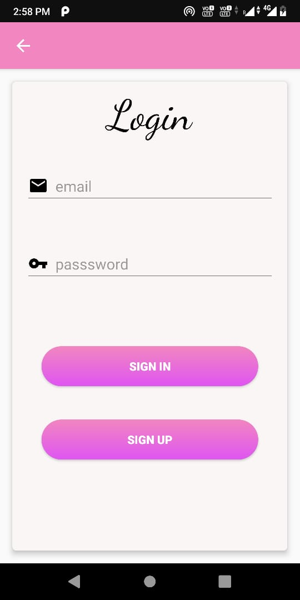
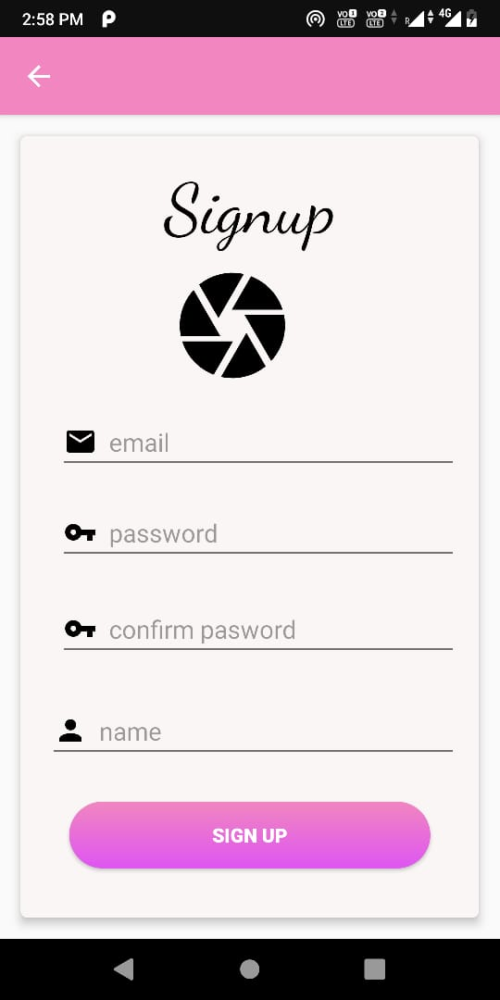
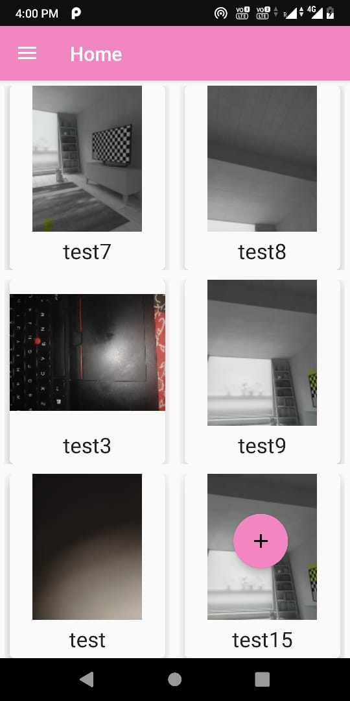
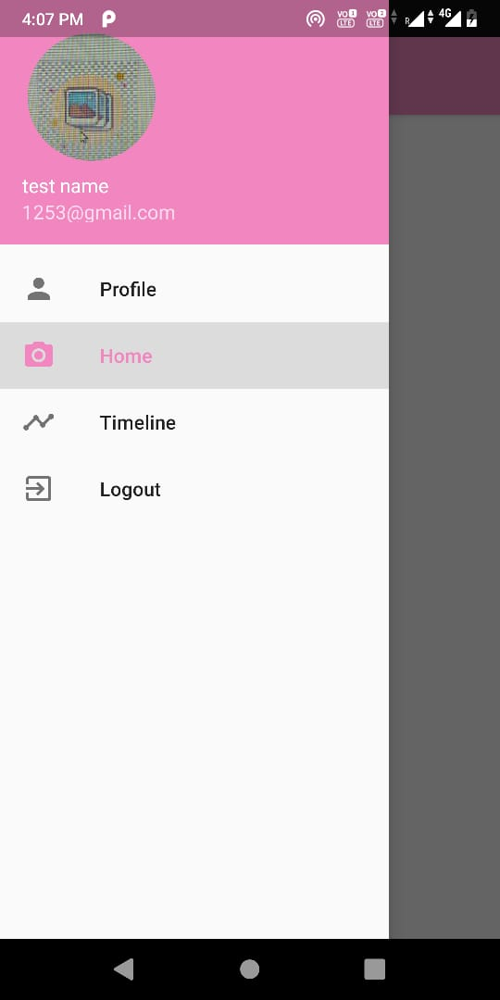
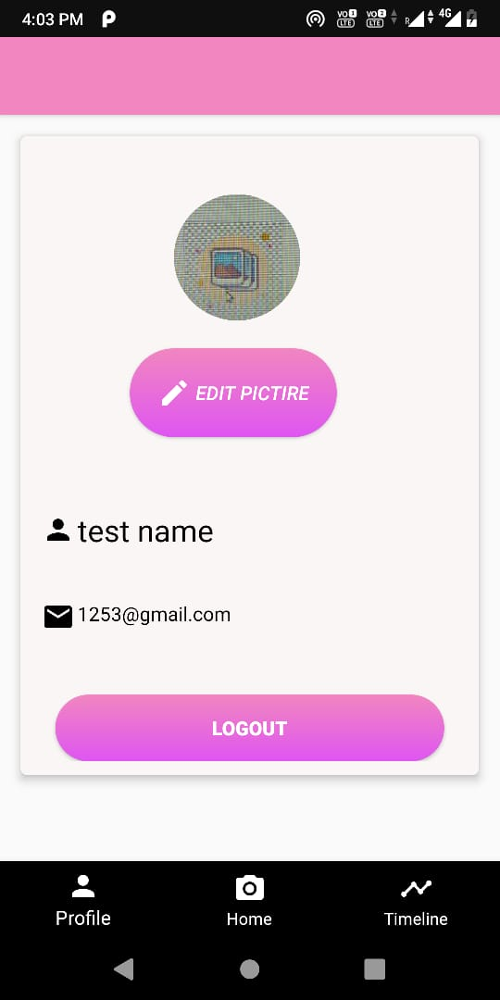
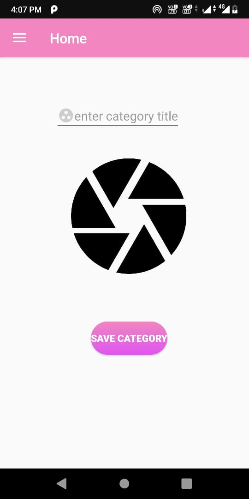
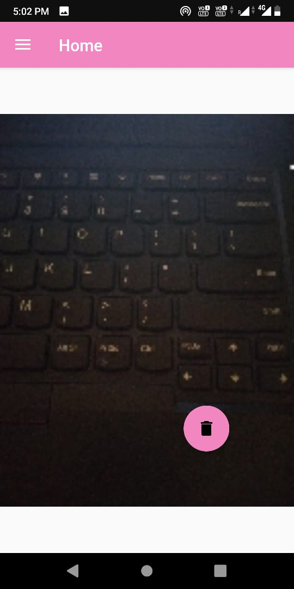
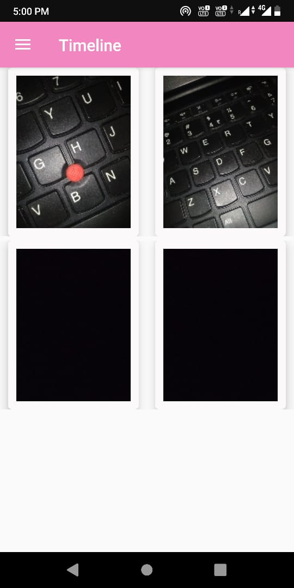

Gallery-Android App
--------------------------

The app basically allows users to create categories, add their pictures in categories. Users can view the pictures in categories and in a timeline view.

------------------------------------------------------------------------------------------------------------
Screenshots-

Login Screen 
-------------------

Allow users to login using email and password.

----------------------------------------

Signup Screen 
--------------------

Allow users to Signup using Name, email, password, and upload a profile image.

------------------------------------------------------------------------------------

Home Screen (Category Screen)
-----------------------------
Here the user can see the list of categories in grid format
Category Image and Category Title
Click on Category to go to Category detail page

----------------------------------------------------

Left Menu Product Flavor
-------------------------------

Bottom Navigation Product Flavor (Profile Screen)
-----------------------------------------------------

Show user Name,  Email, Profile Pic
Logout button
Allow change of Profile Pic

--------------------------------

Add Category Screen 
-----------------------------

User can add a category 

--------------------------

Image Full Screen 
----------------------
image is clicked show in full screen mode, with an option of delete image.

-------------------------------

-------------------------------

Timeline
-------------------

Timeline (This is view only)
Show images in one list according to the time they were uploaded, recent one comes to the top.

-----------------------------------------------------------------

